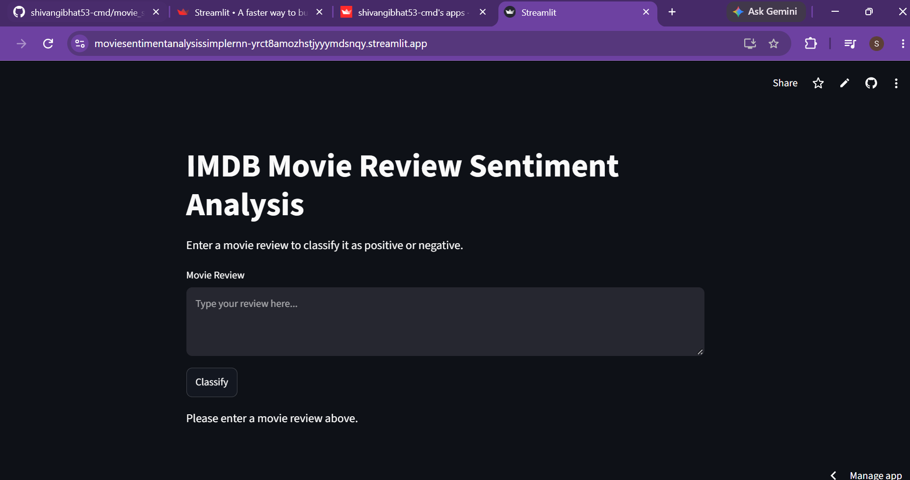
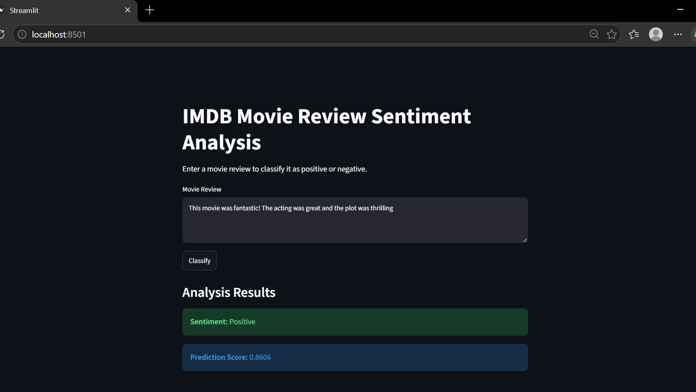
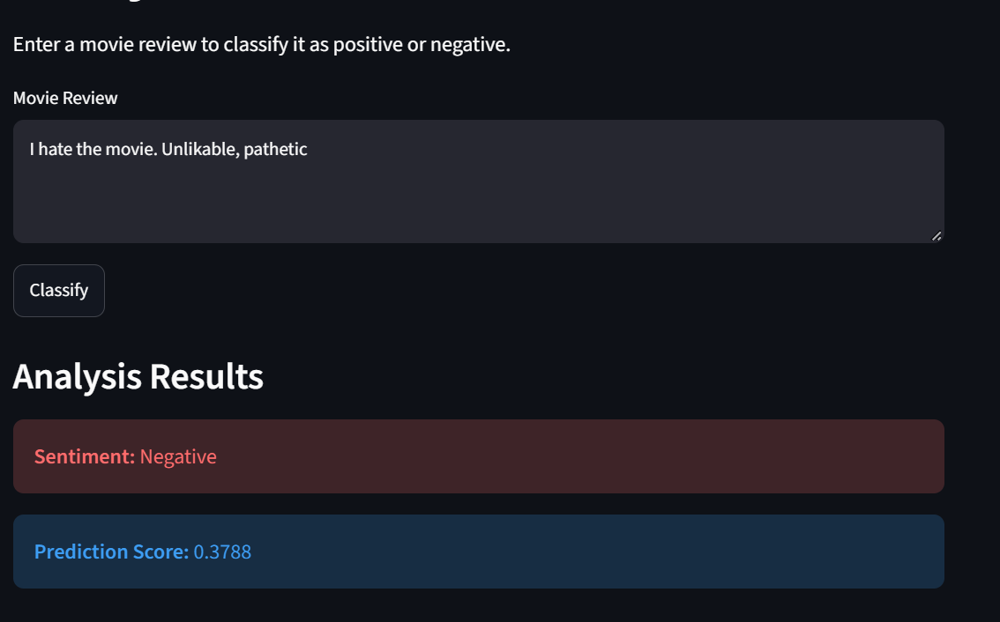
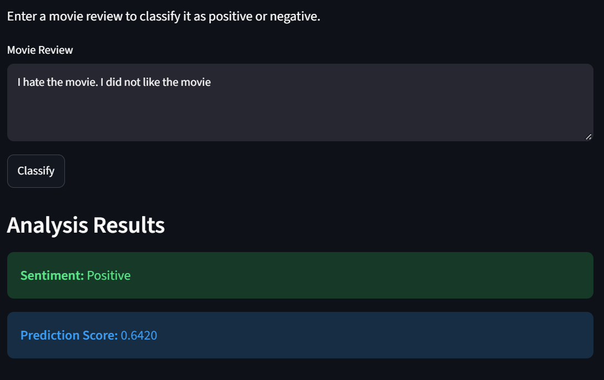

<div align="center">

# 🎬 IMDB Movie Review Sentiment Analysis

**A Simple RNN built from scratch with TensorFlow/Keras, deployed as an interactive Streamlit app.**


[**🔗 Live Demo**](https://moviesentimentanalysissimplernn-yrct8amozhstjyyymdsnqy.streamlit.app/) · [Model Architecture](#model-architecture) · [Results](#training--results) · [Limitations](#model-limitations--honest-analysis)

</div>

---

## Overview

A binary sentiment classifier that reads a movie review and predicts whether it's **positive** or **negative**, trained on the classic IMDB dataset (25,000 labeled reviews) using a **Simple RNN** — the most basic recurrent architecture, chosen deliberately as a foundation before moving to LSTM/GRU/Transformer-based approaches. The trained model is deployed as a live, interactive Streamlit app where anyone can type a review and get an instant prediction.

This README documents not just what was built, but **what worked, what didn't, and why** — including a real false-positive case and a genuine deployment bug that came up when loading a legacy model file into a newer Keras runtime.

---

## Live Demo

🔗 **[https://moviesentimentanalysissimplernn-yrct8amozhstjyyymdsnqy.streamlit.app/](https://moviesentimentanalysissimplernn-yrct8amozhstjyyymdsnqy.streamlit.app/)**



---

## Table of Contents

- [Overview](#overview)
- [Live Demo](#live-demo)
- [Demo Screenshots](#demo-screenshots)
- [Tech Stack](#tech-stack)
- [Dataset](#dataset)
- [Project Structure](#project-structure)
- [Model Architecture](#model-architecture)
- [Training & Results](#training--results)
- [Model Limitations — Honest Analysis](#model-limitations--honest-analysis)
- [Notebooks](#notebooks)
- [Setup & Installation](#setup--installation)
- [Usage](#usage)
- [Technical Notes & Bugs Fixed](#technical-notes--bugs-fixed)
- [Future Improvements](#future-improvements)
- [Author](#author)

---

## Demo Screenshots

**Correctly classified positive review:**



**Correctly classified negative review:**



**A misclassification — see [Model Limitations](#model-limitations--honest-analysis) for why this happens:**



---

## Tech Stack

| Category | Tools |
|---|---|
| Language | Python |
| Deep learning | TensorFlow / Keras (`SimpleRNN`, `Embedding`, `Dense`) |
| Data | Keras' built-in IMDB dataset |
| Web app | Streamlit |
| Experimentation | Jupyter notebooks |
| Visualization | matplotlib |

---

## Dataset

The [Keras built-in IMDB dataset](https://keras.io/api/datasets/imdb/) — 50,000 movie reviews (25,000 train / 25,000 test), pre-tokenized and pre-labeled as positive (1) or negative (0). Vocabulary is capped at the **10,000 most frequent words**; reviews are padded/truncated to a fixed length of **200 tokens** for training.

Keras' `imdb.get_word_index()` provides the word→integer mapping used to encode raw text, with indices shifted by +3 to reserve `0` (padding), `1` (start-of-sequence), and `2` (out-of-vocabulary) as special tokens.

---

## Project Structure

```
movie_sentiment_analysis_simplernn/
├── main.py                        # Streamlit app — loads the trained model and serves predictions
├── requirements.txt                # Python dependencies
├── .gitignore
├── README.md
│
├── simple_rnn_imdb.h5              # Trained model (legacy Keras H5 format, ~15 MB)
│
├── embedding.ipynb                 # Standalone exploratory notebook: how word embeddings work
├── simple_rnn.ipynb                # Main notebook: loads IMDB data, builds + trains the RNN, saves the model
├── prediction.ipynb                # Loads the saved model and runs a manual prediction demo
│
└── images/
    ├── app_deployed_on_streamlit.png   # Live app screenshot
    ├── positive_sent_analysis.png      # Correct positive classification
    ├── true_negative_result.png        # Correct negative classification
    └── false_positive_result.png       # A documented misclassification
```

---

## Model Architecture

```
Input (200 tokens)
  → Embedding(input_dim=10,000, output_dim=128)
  → SimpleRNN(128 units, activation='tanh')
  → Dense(1, activation='sigmoid')
```

| Layer | Output Shape | Parameters |
|---|---|---|
| Embedding | (None, 200, 128) | 1,280,000 |
| SimpleRNN | (None, 128) | 32,896 |
| Dense | (None, 1) | 129 |
| **Total** | | **1,313,025** (~5.01 MB) |

**Compilation:** `Adam` optimizer (learning rate `0.0005`), `binary_crossentropy` loss, `accuracy` metric.

---

## Training & Results

Trained for up to 10 epochs with `EarlyStopping` (`monitor='val_loss'`, `patience=3`, `restore_best_weights=True`) on an 80/20 train/validation split, batch size 64.

| Epoch | Train Loss | Train Acc | Val Loss | Val Acc |
|---|---|---|---|---|
| 1 | 0.6292 | 62.82% | 0.5357 | 74.10% |
| 2 | 0.4025 | 82.56% | 0.3934 | 82.64% |
| **3** | **0.2998** | **87.83%** | **0.3847** | **83.86%** ← best |
| 4 | 0.2689 | 89.20% | 0.4029 | 83.62% |
| 5 | 0.1985 | 92.45% | 0.4161 | 83.18% |
| 6 | 0.1434 | 94.82% | 0.5069 | 82.96% |

Training stopped early after epoch 6 (3 epochs with no val-loss improvement past epoch 3), and the **weights from epoch 3 were restored** as the final saved model — giving a final validation accuracy of **83.86%**.

**What this curve actually shows:** training accuracy climbed to 94.8% while validation accuracy plateaued and then slowly degraded from epoch 3 onward — textbook **overfitting**. `EarlyStopping` with `restore_best_weights=True` is doing its job correctly here, catching the model at its best generalization point rather than its highest training accuracy.

---

## Model Limitations — Honest Analysis

A plain `SimpleRNN` is a deliberately weak baseline, and the deployed app exposes exactly why.

**Failure case:** the review *"I hate this movie. I didn't like it at all"* — unambiguously negative to a human — gets classified **Positive**, typically scoring around **0.6–0.7**. This isn't a one-off fluke; it's reproducible with similarly-structured negative reviews that use negation phrasing ("didn't like," "not good," "hate... but ...") spread across multiple short clauses.

**Root cause, in plain terms:** the model isn't able to capture long-range dependencies between words or reliably carry earlier context forward through the sentence. `SimpleRNN` updates a single hidden state one word at a time, and that hidden state's influence from early tokens (like "hate," at the start) decays sharply by the time the network reaches the end of the sentence — the classic **vanishing gradient problem** in recurrent networks. By the final word, the network has effectively "forgotten" the strong negative signal it saw a few words earlier, and whatever's left in the hidden state at that point dominates the sigmoid output.

**The contrast that proves it:** the review *"I hate this movie. Unlikeable, pathetic"* **is** correctly classified negative. The difference isn't sentence length or vocabulary difficulty — it's that every word here is independently, unambiguously negative ("hate," "unlikeable," "pathetic"), so the model doesn't need to *remember* anything or resolve any negation across clauses to get the right answer. It can get away with a near-bag-of-words strategy. The moment correctness depends on carrying information across the sentence — negation, contrast, or a sentiment word early on that needs to still matter at the end — the architecture's core weakness shows up.

This is precisely why production sentiment models use LSTM, GRU, or Transformer-based architectures (see [Future Improvements](#future-improvements)) — architectures specifically designed with gating mechanisms (LSTM/GRU) or full-sequence attention (Transformers) to preserve exactly the kind of long-range dependency this model loses. This project intentionally starts with the simplest recurrent baseline to demonstrate that gap empirically, not just describe it.

---

## Notebooks

### `embedding.ipynb` — Word Embeddings 101 (exploratory, standalone)
A small standalone walkthrough of how word embeddings work, independent of the main pipeline: one-hot encodes a handful of toy sentences, pads them to a fixed length, and passes them through a single `Embedding` layer to inspect the resulting dense vector representations. Useful as a mental model builder, not part of the trained pipeline.

### `simple_rnn.ipynb` — Main Training Notebook
Loads the IMDB dataset, decodes a sample review back to English for sanity-checking, pads sequences to length 200, builds and trains the `SimpleRNN` model described above, and saves it as `simple_rnn_imdb.h5`.

### `prediction.ipynb` — Manual Inference Demo
Loads the saved model and defines `preprocess_text()` / `predict_sentiment()` helpers to classify a single example review outside of the Streamlit app — useful for quick sanity checks during development.

---

## Setup & Installation

### 1. Clone the repository
```bash
git clone <repo-url>
cd movie_sentiment_analysis_simplernn
```

### 2. Create a conda environment
```bash
conda create -p venv python==3.10 -y
conda activate venv/
```

### 3. Install dependencies
```bash
pip install -r requirements.txt
```

---

## Usage

### Run the Streamlit app locally
```bash
streamlit run main.py
```
Opens at `http://localhost:8501`. Type a review into the text box and click **Classify** to see the predicted sentiment and confidence score.

### Retrain the model
```bash
jupyter notebook simple_rnn.ipynb
```
Run all cells to reproduce training from scratch and regenerate `simple_rnn_imdb.h5`.

### Run a quick manual prediction
```bash
jupyter notebook prediction.ipynb
```

---

## Technical Notes & Bugs Fixed

Real engineering issues encountered while building and deploying this, kept here deliberately rather than smoothed over:

- **Keras 3 / legacy H5 compatibility.** The model was originally saved in the legacy HDF5 format (`model.save('simple_rnn_imdb.h5')`), which Keras 3 flags as deprecated. Loading it in a newer Keras 3 environment raised errors because `SimpleRNN`'s saved config included a `time_major` argument that Keras 3's `SimpleRNN` no longer accepts. **Fix:** `main.py` defines a `PatchedSimpleRNN` subclass that strips `time_major` from both `__init__` and `from_config`, then loads the model via `tf.keras.utils.custom_object_scope({'SimpleRNN': PatchedSimpleRNN})`. This is exactly the kind of framework-version compatibility issue you hit constantly in real deployment work.
- **Inconsistent OOV handling between the notebook and the app.** `prediction.ipynb`'s `preprocess_text()` encodes unknown/rare words as `word_index.get(word, 2) + 3` without checking whether the resulting index actually falls within the trained vocabulary size (10,000) — a word with a raw index near the edge of the vocabulary could produce an out-of-range index for the `Embedding` layer. `main.py`'s version fixes this by explicitly checking `if actual_idx >= 10000` and falling back to the OOV token (`2`) when it does. Worth keeping the notebook and app's preprocessing logic in sync to avoid this class of bug.
- **Padding length mismatch worth double-checking.** The model was trained with sequences padded/truncated to `maxlen=200` (see `simple_rnn.ipynb`), but `main.py`'s `preprocess_text()` currently pads to `maxlen=500`. If you see unexpected behavior at inference, this is the first place to check — align both to `200` to guarantee the app feeds the model exactly the shape it was trained on.

---

## Future Improvements

- **Swap `SimpleRNN` for LSTM or GRU** to directly address the negation-handling failure case documented above — gated architectures are specifically designed to retain long-range dependencies that plain RNNs lose to vanishing gradients.
- **Try a Bidirectional wrapper** (`Bidirectional(LSTM(...))`) so the model has context from both directions of the sentence, not just left-to-right.
- **Use pretrained embeddings** (GloVe or Word2Vec) instead of learning embeddings from scratch on a 10,000-word vocabulary, to capture richer semantic relationships from a much larger corpus.
- **Add attention**, or move to a Transformer-based encoder (e.g. fine-tuning DistilBERT, as explored in a related project), to better resolve exactly the kind of compositional negation this model currently gets wrong.
- **Save in native Keras format** (`model.save('model.keras')`) instead of legacy HDF5, removing the need for the `PatchedSimpleRNN` compatibility shim entirely.
- **Add a proper evaluation report** (confusion matrix, precision/recall, a curated set of adversarial/negation test cases) rather than relying on ad-hoc manual examples to characterize model behavior.

---

## Author

**Shivangi**
📧 shivangibhat53@gmail.com